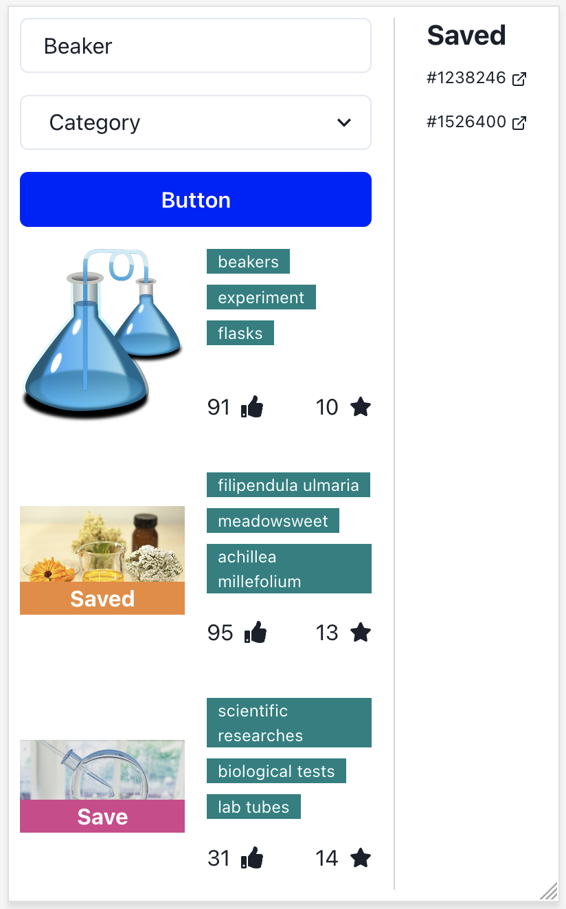
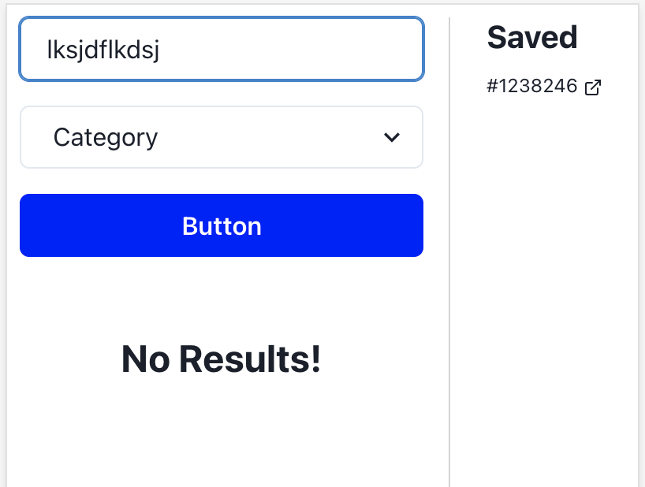
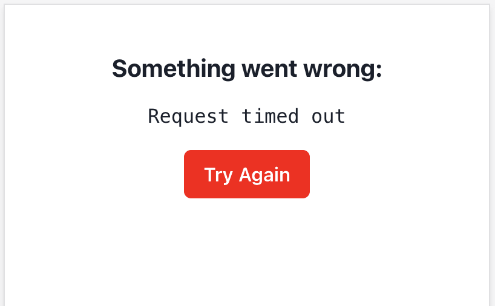

# Pixabay Photo Search

Image search using [pixabay.com](https://pixabay.com/). Allows for searching by keywords and/or category. Results can be viewed inline and "saved" to a side bar.

## Tech Used

| Tech                   | Description                                                          |
| ---------------------- | -------------------------------------------------------------------- |
| "react"                | FE framework                                                         |
| "@chakra-ui"           | UI Framework                                                         |
| "@emotion"             | CSS-In-JS                                                            |
| "fp-ts"                | For `pipe` composition                                               |
| "gts"                  | Project bootstrapping, linting, formatting. (Prettier, ESLint, etc.) |
| "ky"                   | Thin wrapper around `fetch`                                          |
| "ramda"                | Utility functions                                                    |
| "react-error-boundary" | Wrapper around Error Boundary class component                        |
| "react-icons"          | Additional icons.                                                    |
| "typescript"           | Static typing                                                        |
| "zod"                  | Runtime type checking                                                |

## Environment variables

Update in `.env`. See `.env.example`.

| Env Var                   | Default |
| ------------------------- | ------- |
| REACT_APP_PIXABAY_API_KEY |         |
| REACT_APP_PIXABAY_URL     |         |

## Screen Shots

### Search Results



### No Results



### Error Boundary



## Quick Start

```shell
yarn install
yarn start
```

## Available Scripts

In the project directory, you can run:

### `npm start`

Runs the app in the development mode.<br /> Open
[http://localhost:3000](http://localhost:3000) to view it in the browser.

### `npm test`

Launches the test runner in the interactive watch mode.<br /> See the section
about
[running tests](https://facebook.github.io/create-react-app/docs/running-tests)
for more information.

### `npm run build`

Builds the app for production to the `build` folder.<br /> It correctly bundles
React in production mode and optimizes the build for the best performance.
